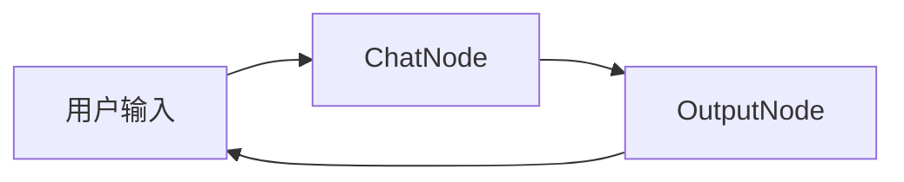
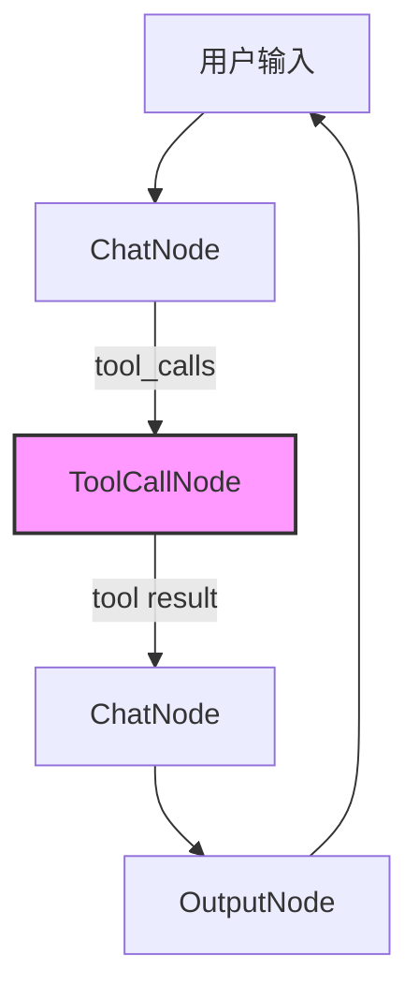
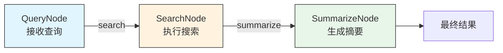
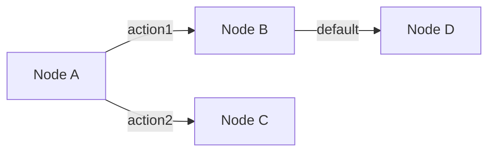

# Examples - 示例代码

本目录包含使用 Node/Flow 框架的各种示例。

## 目录结构

```
examples/
├── chatbot/              # 简单对话机器人
├── chatbot_with_tools/   # 带工具调用的对话机器人
└── workflow/             # 工作流示例
```

## 示例说明

### 1. Chatbot - 简单对话机器人

基础对话机器人，演示简单的 Node 和 Flow 使用。

```bash
python examples/chatbot/main.py
```

**流程图:**


---

### 2. Chatbot with Tools - 带工具调用的对话机器人

演示如何让 LLM 调用工具（如 ls, read 等）并获取结果。

```bash
python examples/chatbot_with_tools/main.py
```

**流程图:**


---

### 3. Workflow - 工作流示例

演示多节点协作的工作流模式。

```bash
python examples/workflow/main.py
```

**搜索工作流:**



**工作流程说明:**
1. **QueryNode**: 接收用户查询，决定路由
2. **SearchNode**: 执行搜索，获取结果
3. **SummarizeNode**: 基于搜索结果生成摘要

---

## Node 核心概念

### 基本 Node

```python
from core.node import Node

class MyNode(Node):
    def exec(self, payload):
        # 处理逻辑
        result = process(payload)
        # 返回 (action, result)
        return "default", result
```

### 节点连接



```python
# 代码实现
node_a - "action1" >> node_b
node_a - "action2" >> node_c
node_b >> node_d
```

---

## 运行环境

所有示例需要设置 API Key:

```bash
export OPENAI_API_KEY_DEEPSEEK=your_key_here
export OPENAI_BASE_URL_DEEPSEEK=https://api.deepseek.com
```
